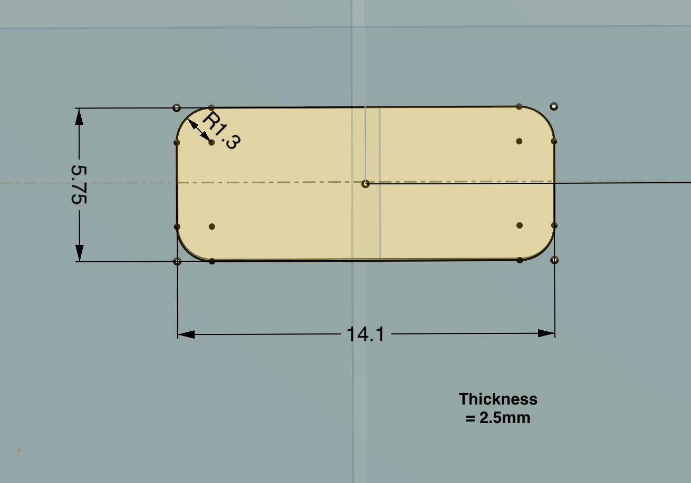

# EC_PWM_FanControlBoards

10 VDC PWM EC fan control boards.  
  
These boards modify Kyle Gabriel’s fan control boards for Mycodo, using USB-C connectors instead of audio connectors. They provide voltage level shifting for PWM use with Raspberry Pi or ESP boards and tach signals (RPM) from compatible fans.  
  
These boards control PWM speed for EC fans supplying 10-12VDC from a USB-C cable (AC Infinity fans or Vivosun fans - perhaps others). I’ve verified the PWM control works well on the AC Infinity Airlift S Series Shutter Fans (with tach) and the AC Infinity Cloudray S6 6” clip fan (without tach). I’ve also tested it on the VIVOSUN AeroWave E6 Gen2, Grow Tent Clip Fan 6” (without tach on this fan, unsure about the larger fans). These tests were done from a Raspberry Pi 4 using Mycodo and from ESP32 boards using ESPHome and MQTT.  
  
  
  
 

I’ve included Gerber files for three board versions:  
  
- Left: ‘USB-C_Breakout_x_2.54’ (modified for offset transistor lead footprint).  
- Center: ‘2.54x2_Breadboard’ (short enough for jumpers on both ends).  
- Right: ‘JST-PH_x_2.54’ (for use with ‘xiwai’ 4-pin cabinet mount cable(link below)).  
  
All boards have 10v and GND pads for tapping into fan power. 

[USB-C Cabinet Mount JST Cable](xiwai 5pcs/Set DIY OEM Type C Female Socket to 4Pin Header Cable Type-C to 4P Waterproof Terminal Wire with Pitch=2.0mm Latch Mount Type USB C Pigtail DC 5V Extension Power Cable)

  
  
  
  
